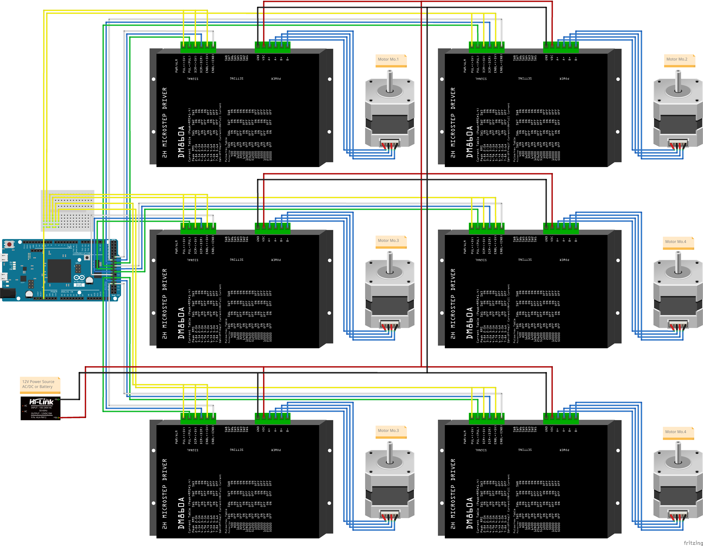
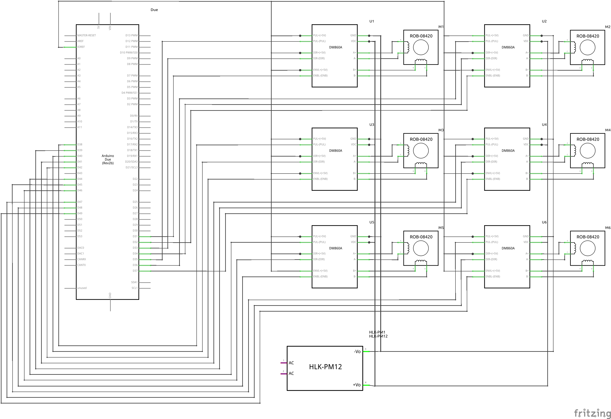

# stepper_pulse_generator_for_arduino_due

## About
With PWM units in Arduino Due (SAM3X8E), this library can generate pulses suitable for rotating the stepper at a desired speed.



## Description
This library is a wrapper for antodom/pwm_lib. I would like to thank Dr. Antonio, the creator of antodom/pwm_lib.

digitalWrite() is mainly used to control the stepper. While this allows the user to freely change the waveform, it requires the arduino to concentrate on its processing. If a time-consuming process such as serial communication is added, the waveform will be distorted.

This library generates waveforms from the PWM units in the Arduino Due. This frees the arduino from the process of generating waveforms and allows it to do other work.

Although a library for generating waveforms originally existed, this library is specialized for steppers. It does not control even the number of pulses generated, so it can be used to operate a stepper at a desired speed.

## Requirement
This library dependent below libraries. They are putted into lib/ as submodule.

- [antodom/pwm_lib](https://github.com/antodom/pwm_lib) 

  This is library to use PWM units.

- [antodom/tc_lib](https://github.com/antodom/tc_lib/)

  This is needed to build pwm_lib.


## How to build example
You can build by VS Platform IO with Visual Studio Code.

1. Clone this repository.
   ```
   git clone https://github.com/hijimasa/stepper_pulse_generator_for_arduino_due.git
   ```

1. Update submodule.
   ```
   cd stepper_pulse_generator_for_arduino_due/
   git submodule update --init
   ```

1. Make the test circuit as below. You can see the actual wiring diagram in the About section.

   Note: You can drive Motor with AC/DC convertors or batteries.

   

1. Open this repository folder with Visual Studio Code.

1. Build and upload source by Platform IO.


## How to use this library
You can build by VS Platform IO with Visual Studio Code.

1. Create new project by Platform IO with Visual Studio Code.

1. Make lib/ directory in the project.

1. Clone this library and required library.
   ```
   cd lib/
   git clone https://github.com/hijimasa/stepper_pulse_generator_for_arduino_due.git
   git clone https://github.com/antodom/pwm_lib.git
   git clone https://github.com/antodom/tc_lib.git
   ```

1. Refer to the example and write the source code under the src directory.

1. Build and upload source by Platform IO.
